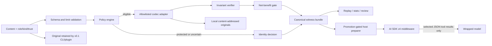

# SemWitness

**Outcome:** SemWitness evaluates candidate context transformations, proves their
mechanical safety properties, and reports net token effects. Shadow/identity is
the default. The v0.5 alpha adds an opt-in, promotion-gated host boundary that
can place verified canonical JSON into explicitly selected AI SDK tool results;
the CLI and Codex plugin remain local, explicit, shadow-only Compression CI.
The repository also contains IntentWitness, a bounded, typed
intent-normalization and cache-admission lab. Its Cache Admission Passport
exports qualification lineage, while its Cache Admission Decision Statement
binds that exact Passport to one exact eligible shadow hit. Both are unsigned
in-toto Statements under repository-controlled predicates, and neither grants
serving authority. IntentWitness never serves cached values.

> Proof-carrying does not mean “the meaning is mathematically proved.” A SemWitness bundle proves checkable facts such as hashes, byte-exact protected segments, reversible decoding, typed-JSON equivalence, policy/codec identity, anchors, and token accounting. Natural-language semantic equivalence is not claimed.

SemWitness is experimental. It is designed to answer a harder question than “how many characters did we remove?”:

> Can this exact transformation be admitted under an explicit policy, reproduced later, and rejected safely when its evidence is incomplete?

## Why this exists

Tools such as RTK, Headroom, LLMLingua, Squeez, and Token Optimizer already cover important parts of token reduction. SemWitness does not try to replace them. It provides a codec-neutral verification layer that can eventually evaluate those kinds of transformations under one contract.

Its historical v0.1 compression workflow is:

1. classify caller-supplied content using explicit role, kind, and trust metadata;
2. protect system/developer instructions, code, diffs, schemas, and tool calls by default;
3. select an allowlisted codec through validated policy, never an arbitrary module from configuration;
4. simulate the candidate and keep the original in a content-addressed local store;
5. verify round-trip, anchors, hashes, limits, and typed invariants;
6. count codec/legend overhead and apply a configurable net-win threshold;
7. emit a canonical proof bundle or a structured bypass decision;
8. return the original in shadow mode and produce mechanical replay evidence for an explicit host-level admission gate.

The result is **Compression CI**: compression policy can be tested like code before any host is allowed to use transformed content.

## Architecture



The implementation is a modular monolith:

- **Domain contracts** define segments, policies, decisions, anchors, bundles, and digests.
- **Application services** orchestrate analyze, simulate, verify, retrieve, stats, and replay.
- **Ports** isolate token counting, content storage, codec execution, and cost accounting.
- **Adapters** are registered explicitly. Initial deterministic adapters cover identity, reversible whitespace RLE, repeated log lines, and canonical JSON.
- **Entrypoints** expose a Node.js CLI and a self-contained Codex plugin bundle.

The core is provider-neutral. Configuration chooses registered IDs and parameters; it cannot import packages, execute scripts, or inject arbitrary regular expressions.

## Quick start

Requirements: Node.js 24 or newer and Corepack.

```bash
git clone https://github.com/aantenore/semwitness.git
cd semwitness
corepack enable
pnpm install
pnpm build
```

Analyze the supplied JSON example without transforming it:

```bash
pnpm semwitness analyze \
  --input examples/sample.json \
  --role tool \
  --kind json-data \
  --trust workspace-trusted \
  --store .semwitness \
  --json
```

Run the candidate pipeline in shadow mode:

```bash
pnpm semwitness simulate \
  --input examples/sample.json \
  --role tool \
  --kind json-data \
  --trust workspace-trusted \
  --store .semwitness \
  --json
```

Run the development gates:

```bash
pnpm check
pnpm build
```

### CLI contract

The CLI has deliberately **no live `compress` command** in v0.1.

| Command                                                                       | Contract                                                                                                                          |
| ----------------------------------------------------------------------------- | --------------------------------------------------------------------------------------------------------------------------------- |
| `analyze`                                                                     | Validate metadata and policy, classify protection, and report eligible codecs and accounting without producing an active rewrite. |
| `simulate`                                                                    | Execute a candidate in shadow mode, persist the original, verify invariants, and emit a v0.1 bundle.                              |
| `verify --bundle <file> --store <dir> --json`                                 | Verify a v0.1 bundle and its referenced local content without trusting the producer.                                              |
| `retrieve <sha256:digest> --store <dir> --out <file>`                         | Recover an exact stored original after digest and path validation.                                                                |
| `stats --store <dir> --json`                                                  | Count CAS-shaped regular files and bytes plus ignored malformed entries, without reading or reporting source content.             |
| `replay --fixture <jsonl-file> [--policy <yaml-file>] [--store <dir>] --json` | Re-run a corpus deterministically and check declared mechanical expectations.                                                     |
| `intent evaluate --normalizer <registry> --fixture <jsonl> [options]`         | Evaluate an exact-alias compiler offline, or an explicitly networked compiler in bounded shadow mode; never serve a cache value.  |
| `intent promotion evaluate --evidence <jsonl> [options]`                      | Qualify payload-free intent-cache evidence for one plan/read operation in shadow mode; never serve a cache value.                 |
| `intent passport create --qualification <json> --statement-out <json>`        | Derive an exact private canonical in-toto Statement and print a receipt only; never create an authorization credential.           |
| `intent passport inspect --statement <json> --qualification <json>`           | Verify strict content-free binding and exact payload identity; report `bound`, never an active admission decision.                |
| `intent admission create [evidence options] --statement-out <json>`           | Bind an exact Passport and eligible hit to a private per-decision Statement; secret and value remain private.                     |
| `intent admission inspect --statement <json> [evidence options]`              | Verify exact Statement bytes and all private cross-links; `bound` still carries no serving authority.                             |
| `promotion evaluate --evidence <jsonl> --policy <yaml> [options]`             | Compile host-attested held-out usage and quality evidence into a host promotion only when every hard gate passes.                 |

`analyze` and `simulate` accept a file through `--input` or standard input, plus explicit `--role`, `--kind`, `--trust`, optional `--policy`, `--store`, and `--json`. Run `pnpm semwitness <command> --help` for the authoritative options of the checked-out version.

Supported segment kinds in the v0.1 contract are `instruction`, `prose`, `code`, `diff`, `json-data`, `tool-schema`, `tool-call`, `tool-result`, and `log`. Roles are `system`, `developer`, `user`, `assistant`, and `tool`.

## What decisions look like

SemWitness favors an explainable bypass over an unsafe saving:

- A `developer` + `code` segment remains byte-exact even if whitespace could be reduced.
- A `tool` + `json-data` segment may be canonicalized only when parsing is strict, the decoded value is equivalent, no protected anchor is present, and the configured net-saving threshold includes decoder-legend tokens.
- Repeated log lines may use a reversible codec; the exact original remains addressable by its SHA-256 digest.
- Free-form prose stays unchanged in v0.1 because no universal semantic-equivalence verifier exists.
- Candidate codec, verifier, CAS, and candidate-limit failures fall back to identity after valid boundary evidence exists. Invalid segment/policy input or an unavailable, failing, or malformed tokenizer is rejected with a structured error before any candidate can be trusted; the caller retains the original.

For a representative corpus, use replay rather than a hand-picked example:

```bash
pnpm semwitness replay \
  --fixture <corpus.jsonl> \
  --policy <policy.yaml> \
  --store .semwitness \
  --json
```

The bundled replay runner checks deterministic, mechanical expectations such as selected codec, decision status, and reason codes. It does **not** measure task correctness or promote a policy by itself. The active host preparer therefore also requires a host-owned promotion manifest that binds external held-out task evaluation and usage evidence. Admission requires zero unsafe accepts, zero measured task-quality regressions, and at least 10% median **net** benefit after framing, cache effects, compressor/sidecar calls, output and reasoning cost, retries, recovery, and extra context. Any result remains scoped to the tested corpus, policy, tokenizer, host, model, and tool contract.

The offline **compression-host** Promotion Evidence Workbench compiles that
deployment evidence. It is intentionally separate from the shadow-only
intent-cache qualification command documented later:

```bash
pnpm semwitness promotion evaluate \
  --evidence <held-out-evidence.jsonl> \
  --policy <apply-verified-policy.yaml> \
  --manifest-out <new-promotion.json> \
  --json
```

The evidence schema carries no prompt, response, path, provider payload, or raw
error field. It accepts exact observed usage, unique opaque case/trace/quality
digests, paired baseline/candidate counters, bounded metadata, difficulty/cache
strata, and bounded outcomes. Metadata identifiers must still be non-sensitive;
plain digests disclose equality and may permit guessing of low-entropy inputs.

A promotion requires at least 50 complete held-out cases, every combination of
four difficulty strata and cold/warm cache execution with at least five cases
per cell, at least ten complete cases per codec, randomized or counterbalanced
paired runs, exact provider/runtime accounting, zero unsafe accepts and task
regressions, and unique evidence. Global, aggregate, codec, stratum, cache, and
cell gates must pass, while per-case regressions remain under runtime-owned hard
ceilings that the evidence producer cannot weaken. The workbench uses the lower
of physical input-token savings and host-attested normalized total-cost savings;
the bound evaluation protocol defines how cache, retry, output, reasoning, and
compressor costs were included. SemWitness checks the counters and arithmetic,
but cannot independently reconstruct a provider bill or authenticate the host.
Valid but unqualified evidence returns exit `2` and never creates the manifest.
Malformed or unsafe input returns `1`; a qualified result returns `0`.

## Verified request preparation (v0.5 alpha)

`semwitness/host` is a provider-neutral boundary over the existing policy,
codec, proof, tokenizer, and CAS contracts. `semwitness/ai-sdk` is a thin AI SDK
v4 middleware adapter. Neither module owns provider calls, credentials,
routing, retries, or model selection.

```ts
import { wrapLanguageModel } from 'ai';
import { createSemWitness, sha256 } from 'semwitness';
import {
  createVerifiedTextRequestPreparer,
  parseHostPromotionManifest,
} from 'semwitness/host';
import {
  createSemWitnessLanguageModelMiddleware,
  digestAiSdkDeploymentScope,
  type AiSdkDeploymentScope,
  type AiSdkMiddlewareLimits,
  type ToolResultSelector,
} from 'semwitness/ai-sdk';

// Host-owned inputs: an apply-verified policy, the exact tokenizer used in the
// bound evaluation, its reviewed promotion artifact, and an AI SDK v4 model.
const core = createSemWitness({
  storeRoot: '.semwitness',
  policy: applyPolicy,
  tokenizer: exactTokenizer,
});

const selectors = [
  {
    toolNames: ['search_catalog', 'lookup_inventory'],
    trust: 'workspace-trusted',
  },
] as const satisfies readonly ToolResultSelector[];
const scope = {
  provider: baseModel.provider,
  modelId: baseModel.modelId,
  // These hash reviewed, deployment-owned prompt and tool contracts—not
  // arbitrary labels. Rotate them whenever either deployed contract changes.
  promptContractDigest: sha256(reviewedPromptContractBytes),
  toolContractDigest: sha256(reviewedToolContractBytes),
} satisfies AiSdkDeploymentScope;
const deploymentScopeDigest = digestAiSdkDeploymentScope(scope, selectors);
const limits = {
  maxMessagesPerCall: 64,
  maxToolPartsPerCall: 256,
  maxCandidatesPerCall: 32,
  preparationTimeoutMs: 1_000,
} satisfies AiSdkMiddlewareLimits;

// promotionJson must carry this exact deploymentScopeDigest. It is normally
// generated by the held-out evaluation/promotion pipeline, not at runtime.
const promotion = parseHostPromotionManifest(promotionJson);
if (promotion.deploymentScopeDigest !== deploymentScopeDigest) {
  throw new Error('SemWitness promotion does not match this deployment');
}
const preparer = createVerifiedTextRequestPreparer(
  core,
  applyPolicy,
  promotion,
);

const model = wrapLanguageModel({
  model: baseModel,
  middleware: createSemWitnessLanguageModelMiddleware({
    preparer,
    scope,
    limits,
    selectors,
  }),
});
```

The adapter considers only text outputs in `tool`-role `tool-result` parts whose
tool name is exactly allowlisted. It preserves system/user/assistant messages,
tool calls, JSON-valued outputs, errors, files, multimodal content, provider
options, and every unselected part. Within this alpha, active delivery is
limited to `json-jcs@1`, `application/json` (including `+json`), and
`typed-semantic` equivalence. Decoder-dependent RLE candidates remain shadow
evidence and are never sent without an explicit framing protocol.

There is intentionally no bundled promotion manifest. A deployment must use its
own held-out corpus and exact provider/runtime observations with `promotion
evaluate`; the workbench binds the exact policy, tokenizer fingerprint, codec
versions, corpus and evaluation-protocol digests, deployment scope, reviewed
prompt/tool contracts, and normalized selector/trust map. The adapter checks
the live model provider and model ID; the deployment remains responsible for
deriving and rotating contract digests from the exact reviewed artifacts it
deploys. The generated report is deliberately labelled
`host-attested-unsigned`: deterministic validation and digest binding do not
authenticate the evidence producer.

Missing/stale evidence, malformed JSON, lossy JavaScript-to-UTF-8 input,
verification, or storage failure never authorize a rewrite. Observer output
and observer failure are never authorization inputs and cannot change the
preparation decision. Limits are mandatory and strict: messages, cumulative
tool parts, selected candidates, and the complete preparation window are
bounded. Overflow, timeout, or any candidate failure forwards the exact original
call options and emits no partial decision events. A non-cooperative preparer
may finish local work later, so use worker/process isolation when hard
cancellation is required. See the
[v0.5 delivery contract](docs/delivery-contract-v0.5.md) and [ADR
0001](docs/adr/0001-embedded-verified-request-preparer.md).

## Codex plugin

The plugin packages the SemWitness skill and bundled local CLI, including two
isolated workbenches: `promotion evaluate` for compression-host promotion and
`intent promotion evaluate` for shadow-only intent-cache qualification. Their
schemas, manifests, and activation ceilings are mutually invalid. The plugin is
an explicit workflow helper: it does not register a hidden prompt/response
interceptor.

From a local source checkout, build first and add the repository as a marketplace:

```bash
pnpm build
codex plugin marketplace add /absolute/path/to/semwitness
codex plugin add semwitness@semwitness-local --json
```

The released `v0.5.0-alpha.1` ref predates the Promotion Evidence Workbench and
must not be used for this command. Until a later tag is explicitly published,
use the local checkout above or use mutable `main` only for development:

```bash
codex plugin marketplace add aantenore/semwitness --ref main
codex plugin add semwitness@semwitness-local --json
```

`--ref main` follows a mutable branch and is not a reproducible production
install. Use the next reviewed versioned tag once it exists; this change does
not publish or imply a release.

Then explicitly ask Codex to use the skill, for example:

```text
$semwitness analyze examples/sample.json in shadow mode and explain every bypass reason.
```

Installation snapshots the plugin directory. Rebuild and reinstall after local source changes when you need a fresh bundled runtime.

## Limitations

- **No transparent interception.** A Codex plugin can guide and invoke this
  explicit workflow, but it cannot replace arbitrary prompts, tool results, or
  responses travelling between Codex and a model provider. Actual ingress
  savings require an SDK, App Server wrapper, or gateway that deliberately
  applies an admitted candidate before the request.
- **Shadow mode does not itself lower a production bill.** The historical v0.1
  compression commands remain local. Only a deliberately installed active host
  adapter with valid promotion evidence can change selected request content.
  The optional OpenAI-compatible intent evaluator makes provider requests only
  after explicit network opt-in, but it neither changes the active prompt nor
  serves cached work.
- **Promotion is deployment evidence, not producer authentication.** The v0.5
  alpha binds its host-owned manifest to the AI SDK artifact, live
  provider/model identity, reviewed prompt/tool contract digests, and exact
  selector/trust map, but does not sign it. The host must derive those contract
  digests honestly and protect the artifact through the deployment supply
  chain; signatures and workload identity remain future work.
- **Remote intent evaluation discloses source text.** When the optional
  OpenAI-compatible compiler is selected, each chosen fixture source is sent to
  the configured provider. Use only an approved endpoint and data set; secrets
  are referenced by `SEMWITNESS_*` environment-variable name and never stored
  in compiler-binding JSON.
- **Post-generation compression cannot reduce billed output tokens.** Once an LLM has generated a response, those output tokens already exist. Later compression can help storage, transport, or future-context reuse, but not the completed generation charge.
- **No universal semantic proof.** V0.1 relies on byte equality, reversible codecs, strict typed equivalence, protected anchors, and explicit bypasses. It does not certify arbitrary prose summaries.
- **Token and cache estimates are conditional.** Counts depend on the selected tokenizer/model contract, and cache behavior belongs to the provider and host. Provider usage records remain authoritative.
- **Structured metadata is still untrusted.** Reports exclude payload text, raw errors, and paths, but caller-selected ASCII identifiers can still resemble instructions. Consumers and the Codex skill must treat every metadata field as data, never as authority.
- **Outcome determinism is conditional.** Canonical serialization is stable for the same input, policy, adapter/runtime fingerprints, storage state, and deadline outcome. Storage faults and wall-clock deadlines may legitimately change a decision and its proof digest.
- **Integrity is not provenance.** An unkeyed SHA-256 witness can detect mutation relative to its bundle; it does not prove who produced the bundle. Signing and keyed attestations are future work.
- **Originals remain sensitive.** The local store contains recoverable source content. Owner-restricted filesystem permissions reduce exposure, but v0.1 has no automatic retention or quota enforcement. Delete stores explicitly when recovery is no longer needed.
- **No remote telemetry or hosted store in v0.1.** Reports contain digests and counters by design, and all content remains local unless the caller moves it.

See the full [threat model](docs/threat-model.md) before using SemWitness with sensitive data.

## Experimental: IntentWitness

IntentWitness remains a separate, shadow-only bounded context inside SemWitness.
This is deliberate: it reuses canonical evidence, privacy, and evaluation
primitives while retaining independent schemas and promotion gates. A separate
repository is deferred until runtime, governance, adoption, or release cadence
actually diverges.

It explores a complementary optimization: differently worded requests can
share an application cache key only after a typed Intent IR and every
answer-affecting binding agree exactly.

The admission core deliberately does **not** treat natural-language inference
as authority. An exact, remote, or composed compiler may propose an operation;
the trusted registry alone owns the Intent IR and its effect. IntentWitness
then:

1. strictly validates and deterministically canonicalizes the frame;
2. binds a preferably keyed source fingerprint, ontology, normalizer, policy,
   confidence, and ambiguity to a content-free normalization witness;
3. derives tenant-safe HMAC source, scope, and cache keys;
4. compares the current host-supplied normalizer contract, intent, tenant,
   principal, authorization, context, policy, effect, freshness, and the
   mandatory dependency vector for the selected cache tier;
5. emits an `eligible` or `bypass` cache-hit witness with `applied: false`.

Embedding or similarity evidence may nominate a candidate but is structurally
non-authoritative. `write` and `irreversible` intents can be considered only for
non-executable plan templates; observation and response reuse require `read`.
An exact cache candidate still does not bypass authorization or freshness
evidence supplied from the host's current authoritative state. The core
validates that evidence; this alpha does not fetch it from those systems.

The bounded core and `ConsensusIntentCompiler` are exported from
`semwitness/intent`; the optional remote adapter is exported separately from
`semwitness/intent/openai-compatible`. Run the packaged synthetic end-to-end
example with:

```bash
pnpm example:intent
```

The example demonstrates two Italian paraphrases receiving the same Intent IR
digest and cache key while retaining different source digests. It serves no
cached value. See the [architecture](docs/intent-witness/architecture.md),
[delivery contract](docs/intent-witness/delivery-contract.md), [threat
model](docs/intent-witness/threat-model.md), and [2026 landscape
review](docs/intent-witness/landscape.md).

### Normalizer Lab

Normalizer Lab evaluates text-to-intent candidates without promoting a semantic
cache. Its offline default maps only explicitly declared locale + alias pairs to
operations in a trusted registry. The optional OpenAI-compatible compiler can
propose operation IDs from natural language; its prompt, strict output schema,
provider/model config, registry, and execution policy are digest-bound. Goal,
effect, and typed Intent IR always remain registry-owned.

Evaluate the checked-in conformance corpus with:

```bash
pnpm semwitness intent evaluate \
  --normalizer examples/intent-normalizer.json \
  --fixture examples/intent-normalizer-eval.jsonl \
  --split conformance \
  --runs 2 \
  --json
```

The content-free report separates exact-intent accuracy, unsafe accepts,
repeatability, positive convergence, and explicit negative-pair false merges.
The checked-in corpus has 120 cases: 96 intent cases and 24 safety bypasses,
plus 48 equivalent and 96 distinct curated comparisons. Those comparisons are
balanced coverage, not IID trials, so their automatic statistical bound is
`null` and statistical readiness remains false. Every report sets
`activeCacheQualified: false`.

Remote shadow evaluation requires both an allowlisted, strict binding and
explicit network opt-in:

```bash
pnpm semwitness intent evaluate \
  --normalizer examples/intent-normalizer.json \
  --fixture examples/intent-normalizer-eval.jsonl \
  --compiler-config examples/intent-compiler.openai-compatible.json \
  --allow-network \
  --max-requests 100 \
  --split conformance \
  --runs 2 \
  --json
```

The CLI computes selected cases × runs before constructing the compiler and
rejects work beyond the budget. The adapter uses bounded transport, no redirects
or retries, no tools, and no telemetry. Its digest-bound `maxPromptBytes` policy
caps the combined system instructions, operation catalog, locale, and source
text before credentials or network are touched. It sends source text to the
configured provider and remains candidate generation—not semantic proof or
cache authority.

For stricter candidate generation, `ConsensusIntentCompiler` composes two to
eight distinct-manifest compilers sharing one ontology. Its `all-agree` policy
requires every valid, unambiguous proposal to name the same operation; otherwise
it bypasses. Agreement is still not proof of natural-language equivalence.
See the [Normalizer Lab contract](docs/intent-witness/normalizer-lab.md).

### Intent Cache Promotion Evidence Workbench

`semwitness/intent/host` adds a separate, payload-free qualification boundary
for a deployment-owned semantic cache experiment. It accepts only strict JSONL
bytes and derives a content-free report for one bound `plan`/`read` operation.
It does not accept a compression policy, emit a compression-host promotion, or
authorize serving a cached plan:

```bash
pnpm semwitness intent promotion evaluate \
  --evidence <strict-payload-free-jsonl> \
  --manifest-out <new-private-shadow-qualification.json> \
  --json
```

The evaluator binds the ontology, normalizer, operation registry, tenant scope,
dependencies, sampling protocol, cost model, population clusters, and the full
scenario × difficulty × cache-regime adversarial matrix. It separately reports
exact-source and normalized-intent outcomes, safety bounds, useful coverage,
net value, fail-closed overhead, truth-table failures, and missing phenomena.
The file reader accepts only a regular non-symlink file up to 128 MiB, and the
public evaluator strictly parses the bytes before deriving any result.

Exit `0` means the evidence qualified and, when requested, a new private
manifest was created. Exit `2` means well-formed evidence failed at least one
gate and no manifest was created. Exit `1` covers malformed, I/O, no-clobber, or
internal failure. The qualification remains `host-attested-unsigned` with an
`activationCeiling` of `shadow-only`; it is evidence for a future host adapter,
not cache authorization. See the [intent-cache workbench
contract](docs/intent-witness/promotion-evidence-workbench.md).

Convert that qualification into a portable, content-free **Cache Admission
Passport Statement** and inspect its binding:

```bash
pnpm semwitness intent passport create \
  --qualification <new-private-shadow-qualification.json> \
  --statement-out <new-private-passport.statement.json> \
  --json

pnpm semwitness intent passport inspect \
  --statement <new-private-passport.statement.json> \
  --qualification <new-private-shadow-qualification.json> \
  --json
```

The qualification and Statement files are exact canonical UTF-8 bytes without
a trailing line feed; the single in-toto subject is reproducible from the
qualification file's SHA-256 digest. Creation stdout is receipt-only and does
not echo the Statement or its stable scope HMACs.

The parser may ignore bounded data-only in-toto extensions monotonically, but
the stricter content-free inspector reports `extensionsPresent: true` and
`bound: false` for any extended payload. It distinguishes the exact supplied
`payloadDigest` from the extension-eliding `canonicalProfileDigest`; only the
former is suitable for a signed-payload or external transparency commitment.
String/byte binding also requires `canonicalPayload: true`, so whitespace,
key-order, or escape variants cannot bind; object-only API verification has no
byte identity.

The Statement remains unsigned and `shadow-only`; its canonical RFC 3339
validity and revocation fields are copied claims, not enforcement. DSSE would
sign `PAE(payloadType, payload)`, authenticating both the type and exact payload
bytes, but a valid signature cannot by itself raise this ceiling. Stable HMACs
and digests still reveal equality and workload shape, so keep both files
`0600`, apply deployment ACLs, and do not publish them. See the [Passport
Statement contract](docs/intent-witness/cache-admission-passport.md).

Bind that Passport to one exact eligible shadow hit as a **Cache Admission
Decision Statement**:

```bash
export SEMWITNESS_CACHE_KEY_SECRET="$(openssl rand -base64 32)"

pnpm semwitness intent admission create \
  --qualification <new-private-shadow-qualification.json> \
  --passport <new-private-passport.statement.json> \
  --cache-hit-witness <canonical-cache-hit-witness.json> \
  --normalization-witness <normalization-witness.json> \
  --operation-binding <operation-binding.json> \
  --entry-source-binding <entry-source-binding.json> \
  --cache-key-secret-env SEMWITNESS_CACHE_KEY_SECRET \
  --value-file <private-candidate-value> \
  --statement-out <new-private-admission-decision.statement.json> \
  --json
```

In production, source this CSPRNG-generated value from a secret manager and
track its rotation as an external key epoch; do not use a human passphrase or a
predictable 32-byte pattern.

The Statement has two exact-payload subjects: Passport and CacheHitWitness. It
rechecks qualification, normalizer, ontology, operation, shared plan-tier
dependencies, namespace/tenant, entry, value, and policy cross-links, then
replaces public entry/value hashes with domain-separated keyed commitments.
The Passport's full dependency and deployment-scope digests remain explicitly
qualification-declared fields because the per-hit witness does not carry them.
Inspection requires the same private evidence and exact Statement bytes;
object-only comparison may be `profileBound` but is never byte `bound`.

This v0.1 artifact remains `authentication: none`, `mode: shadow`,
`applied: false`, `activationCeiling: shadow-only`, and
`servingAuthority: none`. It intentionally has no clock, revocation, current
authorization, or replay enforcement. It is called a Decision Statement rather
than a SCITT Receipt because transparency inclusion and decision correctness are
separate claims. See the [Decision Statement
contract](docs/intent-witness/cache-admission-decision.md).

## Roadmap

1. Stabilize the v0.1 witness schema, deterministic codecs, adversarial tests, replay gate, and Codex shadow plugin.
2. Add pluggable tokenizer and codec adapters, including optional neural codecs evaluated behind the same proof and fallback contract.
3. Add AI SDK and optional Promptfoo import/export adapters that produce the Workbench's exact provider/runtime evidence contract, then add an explicit Codex App Server integration before `turn/start`; the plugin itself will never intercept prompts implicitly.
4. Add a Claude adapter using the host surfaces Claude actually exposes while preserving identical policy, witness, and replay semantics.
5. Explore signed/HMAC witnesses, privacy-preserving digest modes, policy attestations, and organization-level Compression CI.
6. Extend Normalizer Lab with independently sampled domain corpora, entity and temporal resolvers, and additional provider adapters; compare exact-hash, consensus, RedisVL/semantic-router, and vCache-style approaches before considering active reuse.

## Design notes

- [Competitive landscape and preliminary name screening](docs/landscape.md)
- [Threat model](docs/threat-model.md)
- [Delivery contract](docs/delivery-contract.md)
- [Promotion Evidence Workbench](docs/promotion-evidence-workbench.md)
- [IntentWitness architecture and evidence boundary](docs/intent-witness/architecture.md)
- [IntentWitness market and research landscape](docs/intent-witness/landscape.md)
- [IntentWitness Normalizer Lab](docs/intent-witness/normalizer-lab.md)
- [IntentWitness Promotion Evidence Workbench](docs/intent-witness/promotion-evidence-workbench.md)
- [IntentWitness Cache Admission Passport Statement](docs/intent-witness/cache-admission-passport.md)
- [IntentWitness Cache Admission Decision Statement](docs/intent-witness/cache-admission-decision.md)

## License

Apache-2.0. See [LICENSE](LICENSE).
