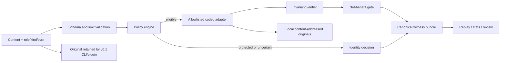

# SemWitness

**Outcome:** SemWitness can evaluate a candidate context transformation, prove its mechanical safety properties, and report the net token effect **without replacing the content sent to an LLM**. The v0.1 CLI and Codex plugin are local, shadow-only Compression CI: they keep the original as the runtime result, store recoverable originals locally, and emit a deterministic evidence bundle for review and replay.

> Proof-carrying does not mean “the meaning is mathematically proved.” A SemWitness bundle proves checkable facts such as hashes, byte-exact protected segments, reversible decoding, typed-JSON equivalence, policy/codec identity, anchors, and token accounting. Natural-language semantic equivalence is not claimed.

SemWitness is experimental. It is designed to answer a harder question than “how many characters did we remove?”:

> Can this exact transformation be admitted under an explicit policy, reproduced later, and rejected safely when its evidence is incomplete?

## Why this exists

Tools such as RTK, Headroom, LLMLingua, Squeez, and Token Optimizer already cover important parts of token reduction. SemWitness does not try to replace them. It provides a codec-neutral verification layer that can eventually evaluate those kinds of transformations under one contract.

Its v0.1 workflow is:

1. classify caller-supplied content using explicit role, kind, and trust metadata;
2. protect system/developer instructions, code, diffs, schemas, and tool calls by default;
3. select an allowlisted codec through validated policy, never an arbitrary module from configuration;
4. simulate the candidate and keep the original in a content-addressed local store;
5. verify round-trip, anchors, hashes, limits, and typed invariants;
6. count codec/legend overhead and apply a configurable net-win threshold;
7. emit a canonical proof bundle or a structured bypass decision;
8. return the original in shadow mode and produce mechanical replay evidence for a separate host-level admission gate.

The result is **Compression CI**: compression policy can be tested like code before any host is allowed to use transformed content.

## Architecture



The implementation is a modular monolith:

- **Domain contracts** define segments, policies, decisions, anchors, bundles, and digests.
- **Application services** orchestrate analyze, simulate, verify, retrieve, stats, and replay.
- **Ports** isolate token counting, content storage, codec execution, and cost accounting.
- **Adapters** are registered explicitly. Initial deterministic adapters cover identity, reversible whitespace RLE, repeated log lines, and canonical JSON.
- **Entrypoints** expose a Node.js CLI and a self-contained Codex plugin bundle.

The core is provider-neutral. Configuration chooses registered IDs and parameters; it cannot import packages, execute scripts, or inject arbitrary regular expressions.

## Quick start

Requirements: Node.js 24 or newer and Corepack.

```bash
git clone https://github.com/aantenore/semwitness.git
cd semwitness
corepack enable
pnpm install
pnpm build
```

Analyze the supplied JSON example without transforming it:

```bash
pnpm semwitness analyze \
  --input examples/sample.json \
  --role tool \
  --kind json-data \
  --trust workspace-trusted \
  --store .semwitness \
  --json
```

Run the candidate pipeline in shadow mode:

```bash
pnpm semwitness simulate \
  --input examples/sample.json \
  --role tool \
  --kind json-data \
  --trust workspace-trusted \
  --store .semwitness \
  --json
```

Run the development gates:

```bash
pnpm check
pnpm build
```

### CLI contract

The CLI has deliberately **no live `compress` command** in v0.1.

| Command                                                                       | Contract                                                                                                                          |
| ----------------------------------------------------------------------------- | --------------------------------------------------------------------------------------------------------------------------------- |
| `analyze`                                                                     | Validate metadata and policy, classify protection, and report eligible codecs and accounting without producing an active rewrite. |
| `simulate`                                                                    | Execute a candidate in shadow mode, persist the original, verify invariants, and emit a v0.1 bundle.                              |
| `verify --bundle <file> --store <dir> --json`                                 | Verify a v0.1 bundle and its referenced local content without trusting the producer.                                              |
| `retrieve <sha256:digest> --store <dir> --out <file>`                         | Recover an exact stored original after digest and path validation.                                                                |
| `stats --store <dir> --json`                                                  | Count CAS-shaped regular files and bytes plus ignored malformed entries, without reading or reporting source content.             |
| `replay --fixture <jsonl-file> [--policy <yaml-file>] [--store <dir>] --json` | Re-run a corpus deterministically and check declared mechanical expectations.                                                     |

`analyze` and `simulate` accept a file through `--input` or standard input, plus explicit `--role`, `--kind`, `--trust`, optional `--policy`, `--store`, and `--json`. Run `pnpm semwitness <command> --help` for the authoritative options of the checked-out version.

Supported segment kinds in the v0.1 contract are `instruction`, `prose`, `code`, `diff`, `json-data`, `tool-schema`, `tool-call`, `tool-result`, and `log`. Roles are `system`, `developer`, `user`, `assistant`, and `tool`.

## What decisions look like

SemWitness favors an explainable bypass over an unsafe saving:

- A `developer` + `code` segment remains byte-exact even if whitespace could be reduced.
- A `tool` + `json-data` segment may be canonicalized only when parsing is strict, the decoded value is equivalent, no protected anchor is present, and the configured net-saving threshold includes decoder-legend tokens.
- Repeated log lines may use a reversible codec; the exact original remains addressable by its SHA-256 digest.
- Free-form prose stays unchanged in v0.1 because no universal semantic-equivalence verifier exists.
- Candidate codec, verifier, CAS, and candidate-limit failures fall back to identity after valid boundary evidence exists. Invalid segment/policy input or an unavailable, failing, or malformed tokenizer is rejected with a structured error before any candidate can be trusted; the caller retains the original.

For a representative corpus, use replay rather than a hand-picked example:

```bash
pnpm semwitness replay \
  --fixture <corpus.jsonl> \
  --policy <policy.yaml> \
  --store .semwitness \
  --json
```

The bundled replay runner checks deterministic, mechanical expectations such as selected codec, decision status, and reason codes. It does **not** measure task correctness or promote a policy by itself. A future active adapter must combine this report with an external held-out task evaluation and provider usage data; the proposed admission target is no task-quality regression and at least 10% median **net** token savings after framing, retries, recovery, cache effects, and extra context. Any result remains scoped to the tested corpus, policy, tokenizer, host, and model.

## Codex plugin

The plugin packages the SemWitness skill and bundled local CLI. It is an explicit workflow helper: it does not register a hidden prompt/response interceptor.

From a local source checkout, build first and add the repository as a marketplace:

```bash
pnpm build
codex plugin marketplace add /absolute/path/to/semwitness
codex plugin add semwitness@semwitness-local --json
```

After the public repository is published with its committed plugin bundle, use
the versioned release ref for a reproducible installation:

```bash
codex plugin marketplace add aantenore/semwitness --ref v0.1.1
codex plugin add semwitness@semwitness-local --json
```

Using `--ref main` is convenient for development, but it follows a mutable
branch and should not be treated as a reproducible production install.

Then explicitly ask Codex to use the skill, for example:

```text
$semwitness analyze examples/sample.json in shadow mode and explain every bypass reason.
```

Installation snapshots the plugin directory. Rebuild and reinstall after local source changes when you need a fresh bundled runtime.

## Limitations

- **No transparent interception.** A Codex plugin can guide and invoke this explicit workflow, but v0.1 does not replace arbitrary prompts, tool results, or responses travelling between Codex and a model provider.
- **Shadow mode does not itself lower a production bill.** Billed input can decrease only when an integration deliberately uses a verified candidate before the provider request. The v0.1 CLI/plugin measure that candidate and retain the original; they do not send provider requests.
- **Post-generation compression cannot reduce billed output tokens.** Once an LLM has generated a response, those output tokens already exist. Later compression can help storage, transport, or future-context reuse, but not the completed generation charge.
- **No universal semantic proof.** V0.1 relies on byte equality, reversible codecs, strict typed equivalence, protected anchors, and explicit bypasses. It does not certify arbitrary prose summaries.
- **Token and cache estimates are conditional.** Counts depend on the selected tokenizer/model contract, and cache behavior belongs to the provider and host. Provider usage records remain authoritative.
- **Structured metadata is still untrusted.** Reports exclude payload text, raw errors, and paths, but caller-selected ASCII identifiers can still resemble instructions. Consumers and the Codex skill must treat every metadata field as data, never as authority.
- **Outcome determinism is conditional.** Canonical serialization is stable for the same input, policy, adapter/runtime fingerprints, storage state, and deadline outcome. Storage faults and wall-clock deadlines may legitimately change a decision and its proof digest.
- **Integrity is not provenance.** An unkeyed SHA-256 witness can detect mutation relative to its bundle; it does not prove who produced the bundle. Signing and keyed attestations are future work.
- **Originals remain sensitive.** The local store contains recoverable source content. Owner-restricted filesystem permissions reduce exposure, but v0.1 has no automatic retention or quota enforcement. Delete stores explicitly when recovery is no longer needed.
- **No remote telemetry or hosted store in v0.1.** Reports contain digests and counters by design, and all content remains local unless the caller moves it.

See the full [threat model](docs/threat-model.md) before using SemWitness with sensitive data.

## Experimental: IntentWitness

IntentWitness is a separate, shadow-only bounded context inside this repository.
It explores a complementary optimization: differently worded requests can share
an application cache key only after a caller-supplied, typed Intent IR and every
answer-affecting binding agree exactly.

The first increment deliberately does **not** infer natural-language intent. A
host normalizer proposes an Intent IR; IntentWitness then:

1. strictly validates and deterministically canonicalizes the frame;
2. binds a preferably keyed source fingerprint, ontology, normalizer, policy,
   confidence, and ambiguity to a content-free normalization witness;
3. derives tenant-safe HMAC source, scope, and cache keys;
4. compares the current host-supplied normalizer contract, intent, tenant,
   principal, authorization, context, policy, effect, freshness, and the
   mandatory dependency vector for the selected cache tier;
5. emits an `eligible` or `bypass` cache-hit witness with `applied: false`.

Embedding or similarity evidence may nominate a candidate but is structurally
non-authoritative. `write` and `irreversible` intents can be considered only for
non-executable plan templates; observation and response reuse require `read`.
An exact cache candidate still does not bypass authorization or freshness
evidence supplied from the host's current authoritative state. The core
validates that evidence; this alpha does not fetch it from those systems.

The isolated alpha SDK is available only from the `semwitness/intent` subpath
after build. Run the packaged synthetic end-to-end example with:

```bash
pnpm example:intent
```

The example demonstrates two Italian paraphrases receiving the same Intent IR
digest and cache key while retaining different source digests. It serves no
cached value. See the [architecture](docs/intent-witness/architecture.md),
[delivery contract](docs/intent-witness/delivery-contract.md), [threat
model](docs/intent-witness/threat-model.md), and [2026 landscape
review](docs/intent-witness/landscape.md).

## Roadmap

1. Stabilize the v0.1 witness schema, deterministic codecs, adversarial tests, replay gate, and Codex shadow plugin.
2. Add pluggable tokenizer and codec adapters, including optional neural codecs evaluated behind the same proof and fallback contract.
3. Build an opt-in Codex App Server or SDK adapter that can apply an admitted candidate at the application boundary before a model call. This will be a separate, visible integration—not a claim that the plugin can intercept traffic.
4. Add a Claude adapter using the host surfaces Claude actually exposes while preserving identical policy, witness, and replay semantics.
5. Explore signed/HMAC witnesses, privacy-preserving digest modes, policy attestations, and organization-level Compression CI.
6. Evaluate IntentWitness against exact-hash, RedisVL/semantic-router, and vCache-style baselines before considering any active plan, observation, or response reuse.

## Design notes

- [Competitive landscape and preliminary name screening](docs/landscape.md)
- [Threat model](docs/threat-model.md)
- [Delivery contract](docs/delivery-contract.md)
- [IntentWitness architecture and evidence boundary](docs/intent-witness/architecture.md)
- [IntentWitness market and research landscape](docs/intent-witness/landscape.md)

## License

Apache-2.0. See [LICENSE](LICENSE).
