# IntentWitness architecture

_Shadow MVP design baseline — 2026-07-15_

## Outcome

IntentWitness asks whether previously observed work has the _same canonical
intent and the same answer-affecting authority and state_. Callers may supply an
already-produced Intent IR, use the deterministic exact-alias compiler, select
the optional OpenAI-compatible proposal compiler, or compose two to eight
distinct-manifest compilers with `ConsensusIntentCompiler`. Every compiler can
propose only an operation ID; the trusted registry owns Intent IR and effect.
Entity, unit, temporal, and coreference resolution remain future host adapters.
Different wording can converge on one cache identity, but compiler agreement or
semantic similarity alone can never authorize reuse.

IntentWitness deliberately remains inside SemWitness as an isolated bounded
context. It reuses canonical evidence, privacy, and evaluation conventions
without becoming a compression codec. A repository split remains conditional
on independently diverging runtime, governance, adoption, or release cadence:

- `semwitness.dev/intent-ir/v1alpha1` owns the proposed intent contract;
- `semwitness.dev/normalization-witness/v1alpha1` owns normalization evidence;
- `semwitness.dev/cache-hit-witness/v1alpha1` owns cache-admission evidence;
- canonical JSON is a domain primitive, not a codec;
- future versions evolve independently of `semwitness-bundle/*` and codec
  versions.

The Cache Admission Passport Statement is the outward-facing lineage boundary
for a qualified experiment. It summarizes one separate shadow qualification as
an in-toto Statement with a single digest subject. It contains no cache value
and returns only strict content-free binding evidence. The qualification and
Statement are exact canonical UTF-8 artifacts without trailing line feeds, so
their subject and payload digests are reproducible from file bytes. The
controlled predicate TypeURI is the repository-owned
[`v0.1` specification](../attestations/cache-admission-passport/v0.1.md), and
the artifact version is `0.1.0`.

The parser and admission boundary intentionally differ. The in-toto parser may
ignore bounded data-only extensions monotonically, while the content-free
binding inspector records `extensionsPresent` and returns `bound: false` for
any extended payload. `canonicalProfileDigest` identifies only the normalized
supported profile; `payloadDigest` identifies exact supplied bytes and is the
only suitable digest for a signed-payload or transparency commitment.

The Cache Admission Decision Statement is the next, separate lineage layer. It
binds the exact Passport payload and exact eligible `CacheHitWitness` payload as
two joint in-toto subjects, then derives scope, contract, operation, entry, and
value commitments from separately verified evidence. Public entry/value hashes
are replaced by domain-separated deployment-keyed commitments. Exact-byte
inspection requires the same private candidate value and HMAC secret, but
neither enters the Statement or stdout.

The Decision Statement remains `authentication: none`, `mode: shadow`,
`applied: false`, `activationCeiling: shadow-only`, and
`servingAuthority: none`. It deliberately has no clock, revocation, current
authorization, or replay enforcement. Authentication, trusted approval,
freshness enforcement, atomic replay state, and live serving remain later and
separate boundaries under a new protocol family. See the repository-owned
[`v0.1` specification](../attestations/cache-admission-decision/v0.1.md).

## Two caches, two different problems

| Layer                      | Match semantics                                                         | What a hit saves                                                  | IntentWitness responsibility                                                                          |
| -------------------------- | ----------------------------------------------------------------------- | ----------------------------------------------------------------- | ----------------------------------------------------------------------------------------------------- |
| Provider prompt/KV cache   | Provider-defined common or exact request prefix                         | Repeated input prefill; the model still runs and generates output | Keep stable instructions/tools/templates first and expose provider usage metrics through adapters     |
| Application semantic cache | Application-defined equivalence of a typed request and its dependencies | Potentially skips planning, tool execution, or generation         | Validate supplied Intent IR, enforce exact equality and hard gates, emit evidence, and measure safety |

Intent normalization does not make a provider cache semantic. It can improve a
provider cache only when the final provider request also becomes byte-stable in
the provider's cacheable prefix. Provider policy remains external and
provider-observed usage remains authoritative.

## System flow

```mermaid
flowchart LR
    A["Request + authoritative host context"] --> C["Exact, OpenAI-compatible, or consensus compiler"]
    C -. "operation ID" .-> R["Authoritative operation registry"]
    R --> D["Caller-supplied or registry-owned Intent IR + evidence"]
    D --> B["Boundary validation"]
    B --> E["Strict Intent IR validation"]
    E --> F["Canonical IR bytes + digest"]
    F --> G["Optional caller candidate evidence"]
    G --> H["Exact canonical IR comparison"]
    H --> I["Scope, auth, freshness, policy, effect, dependency gates"]
    I --> J["Tiered eligible / bypass decision"]
    J --> K["Normalization + cache-hit witnesses"]
    A --> L["Ordinary uncached execution"]
    L --> M["Authoritative host-visible result"]
    J -. "shadow comparison only" .-> M
```



The exact-alias compiler remains the offline default. The optional remote
compiler sends selected source text to its configured provider only after
explicit network opt-in; it still returns only an operation proposal. The final
dotted edge is observational. The shadow core never returns a cache value or
changes tool selection, execution, provider input for the host's ordinary path,
or user-visible output; every decision sets `applied: false`.

## Bounded contexts and ports

### Domain core

- **Intent IR:** validated semantic identity of one request.
- **Canonicalizer:** deterministic serialization and hashing owned by the Intent
  IR contract, not the codec registry.
- **Admission policy:** allowed operations, tiers, effects, freshness modes,
  scopes, and dependency requirements.
- **Normalization witness:** source, normalizer artifact/config, ontology,
  policy, canonical IR digest, ambiguity/confidence assessment, optional
  non-authoritative candidate evidence, and reason codes.
- **Cache-hit witness:** exact bound-digest comparison, entry/lookup evidence,
  every hard-gate result, tier decision, and reason codes.
- **Tier binding:** domain-separated `plan`, `observation`, and `response`
  records.

### Replaceable ports

Normalizer Lab implements the candidate compiler boundary with deterministic
exact aliases, an optional OpenAI-compatible adapter, and an all-agree consensus
wrapper. The operation registry remains authoritative. The remaining ports are
future host boundaries, and the original API continues to accept
already-produced Intent IR and digests.

| Port                | Responsibility                                               | Fail-closed behavior                                                                                    |
| ------------------- | ------------------------------------------------------------ | ------------------------------------------------------------------------------------------------------- |
| `IntentCompiler`    | Propose an operation from text and host context              | Bypass on abort, timeout, malformed output, unsupported operation, ambiguity, or consensus disagreement |
| `OperationRegistry` | Resolve namespaced operations and their slot schemas         | Bypass unknown or version-skewed operations                                                             |
| `EntityResolver`    | Resolve aliases to authoritative stable IDs                  | Bypass unresolved, conflicting, or unauthorized entities                                                |
| `TemporalResolver`  | Resolve relative time against an injected clock and timezone | Bypass absent reference time, timezone ambiguity, or invalid range                                      |
| `ContextResolver`   | Bind pronouns/conversation references to immutable digests   | Bypass unresolved or mutable bindings                                                                   |
| `CandidateIndex`    | Retrieve likely operation schemas or stored IR records       | Empty candidates on failure; never admit                                                                |
| `Authorizer`        | Attest current principal access to all bound resources       | Bypass missing, stale, or negative attestation                                                          |
| `FreshnessResolver` | Attest TTL, source version, or immutable snapshot            | Bypass unknown or expired state                                                                         |
| `PolicyEngine`      | Evaluate versioned organization/host policy                  | Bypass missing or unsupported policy                                                                    |
| `TierStore`         | Read/write versioned cache records                           | Treat fault or malformed entry as miss/bypass                                                           |
| `Clock`             | Supply deterministic evaluation and current admission time   | Bypass when required time evidence is unavailable                                                       |
| `TelemetrySink`     | Record bounded counters and reason codes                     | Do not emit payload; sink failure cannot enable a hit                                                   |

Configuration selects registered adapter IDs and bounded parameters. It cannot
load arbitrary modules, execute scripts, or introduce unreviewed schemas.

## Intent IR `v1alpha1`

The IR contains only fields that participate in semantic identity or explicit
output requirements. Operational evidence such as normalizer confidence and a
preferably HMAC-keyed source digest belongs in the witness so it cannot
accidentally fragment or merge semantic keys. `digestIntentSource` remains for
transparent offline fixtures; exported evidence should use
`hmacIntentSourceDigest`.

Illustrative shape:

```json
{
  "schema": "semwitness.dev/intent-ir/v1alpha1",
  "ontology": {
    "id": "example-ontology",
    "version": "1.0.0",
    "digest": "sha256:0000000000000000000000000000000000000000000000000000000000000000"
  },
  "goal": {
    "namespace": "knowledge",
    "action": "explain",
    "object": "redis",
    "polarity": "affirm"
  },
  "slots": [{ "name": "audience", "value": "software-engineer" }],
  "constraints": [
    { "path": "version", "operator": "eq", "value": "latest-known" }
  ],
  "temporal": { "kind": "none" },
  "output": {
    "format": "markdown",
    "locale": "it-IT",
    "detail": "concise"
  },
  "effect": "read"
}
```

The example is not the JSON Schema itself. The implementation schema must:

- reject unknown top-level fields and unsupported versions;
- bind an ontology ID, version, and digest;
- represent goal namespace, action, object, and `affirm`/`negate` polarity;
- require unique slot names and bounded, explicit constraints;
- preserve the distinction between absent, `null`, empty, defaulted, and
  caller-specified values;
- represent temporal intent as `none`, `as-of`, or a UTC range;
- represent output format, locale, and detail explicitly;
- use only `read`, `write`, or `irreversible` effects;
- prohibit NaN, infinity, duplicate keys, unpaired Unicode surrogates, and
  implementation-dependent numeric coercion;
- reject unknown fields and documents over configured bounds.

The core does not insert semantic defaults. The exact-alias baseline resolves
only explicitly configured aliases; remote and consensus compilers still
propose operation IDs and cannot write registry-owned frame fields. No current
compiler resolves entities, units, dates, coreference, or missing values.
Normalizer and ontology bindings identify who proposed the IR; they do not grant
cache authority.

## Canonicalization and equality

The core canonical JSON primitive produces deterministic UTF-8 JSON from a
strictly validated IR. Slots and constraints are sorted deterministically;
duplicate slot names and duplicate canonical constraints are rejected or
deduplicated according to the declared `v1alpha1` contract. Numbers must be
finite; NaN and infinity are invalid.

Admission recomputes the canonical IR digest and requires exact equality among
the normalization witness, lookup binding, and entry binding. This is an exact
canonical identity check, not a similarity threshold. Cache-entry integrity is
also recomputed before any eligible shadow decision.

## Candidate generation is not admission

The core accepts optional `embedding` or `similarity` evidence from the caller
and records it as `authoritative: false`; it does not run a vector index.
Normalizer Lab's exact-alias adapter emits no such evidence. The implemented
OpenAI-compatible adapter uses a model to propose one registry operation; future
candidate adapters may use exact indexes, alias registries, embeddings, vector
search, or reranking to propose:

- likely operation schemas before compilation;
- entity aliases to resolve against authoritative registries;
- existing cache records worth loading for comparison.

Every proposal remains untrusted. A high similarity score, shared route, LLM
"same meaning" judgment, or nearest neighbor cannot satisfy canonical equality
or any hard gate. Adding, removing, or changing candidate evidence may affect
future recall, but it cannot alter which pair is safe to admit once compared.

The remote adapter is exported from
`semwitness/intent/openai-compatible`. Its strict registry is host-owned and
contains the only authoritative Intent IR/effect mapping. The adapter binds its
provider/model configuration, registry, prompt template, strict output schema,
and execution policy into deterministic digests. It disables retries, tools,
and telemetry; accepts credentials only through a configured `SEMWITNESS_*`
environment-variable name; and uses a bounded transport restricted to one
origin and resolved `chat/completions` path, HTTPS except localhost or literal
loopback HTTP, manual redirect rejection, deadline/abort propagation, and
declared plus streamed response-size limits. A digest-bound `maxPromptBytes`
policy also caps the combined system instructions, operation catalog, locale,
and source text before credential resolution or network access. Provider
refusal, warnings, extra content, unknown operations, or malformed output bypass
without returning raw provider errors.

`ConsensusIntentCompiler`, exported from `semwitness/intent`, composes two to
eight compilers that have distinct manifests and the exact same ontology. Its
`all-agree` policy requires every member to return one valid, unambiguous
proposal for the same operation. Confidence is the minimum member confidence;
candidate evidence is deterministically combined within a configured bound.
Any member bypass, failure, malformed output, abort, or disagreement fails
closed. Consensus is additional candidate evidence, not semantic proof.

## Admission algorithm

For each tier, the first mechanical increment performs these steps in order:

1. Strictly validate and canonicalize the caller-supplied Intent IR.
2. Bind its digest to source, normalizer, ontology, and policy evidence.
3. Require the normalizer artifact/config, normalization policy, and confidence
   threshold to match the trusted current host contract; then bypass ambiguity
   or confidence below that threshold.
4. Strictly validate the cache entry and current lookup, then recompute entry
   integrity.
5. Require the exact canonical intent digest in witness, entry, and lookup.
6. Require exact HMAC-bound cache namespace, tenant, principal, authorization,
   and context scope.
7. Require exact host policy, effect, tier, and every mandatory tier-specific
   dependency digest.
8. Require an unexpired TTL or an exact canonical revision set.
9. Permit non-read effects only in the `plan` tier.
10. Emit an eligible or bypass cache-hit witness with `applied: false`.

The trusted host must obtain its current normalizer contract, scope,
authorization, context, policy, clock, revision, and tier dependency bindings.
Future ports will produce those bindings; the current core validates
caller-supplied evidence and verifies exact equality/freshness, but does not call
external systems itself.

The default is bypass, not a low-confidence hit. Gate ordering may be optimized
to avoid expensive work only if it preserves the same fail-closed result and
does not expose cross-scope existence through timing or diagnostics.

## Cache keys and dependency vectors

The first increment ships no cache store, but it does validate the complete
entry/lookup binding and provides `hmacCacheKey`. The helper serializes that
binding deterministically and derives a deployment-keyed, domain-separated key:

```text
HMAC-SHA-256(
  deployment_secret,
  "semwitness.dev/intent-cache-key/v1\0" ||
  canonical_cache_binding
)
```

The result is namespaced as `hmac-sha256:cache-key:*`. It is a pseudonymous
lookup key, not an authorization credential: every retrieved record still
passes the full binding, integrity, effect, and freshness admission checks.
A future `TierStore` should use this helper or pass an equivalent conformance
fixture rather than define its own semantic equality rules.

The canonical binding contains opaque digests, never display names or tokens:

- tenant and application cache-scope digest;
- authorization subject/scope digest and authorizer policy version;
- normalizer artifact/config, normalization policy, and confidence threshold;
- IntentWitness host policy digest;
- effect class;
- schema, compiler, resolver, ontology, and canonicalizer versions;
- tier-specific dependencies.

Tier-specific dependencies are:

| Tier          | Required dependency bindings                                                                                         |
| ------------- | -------------------------------------------------------------------------------------------------------------------- |
| `plan`        | Operation registry, planner contract, tool registry and schemas, host policy, authorization scope                    |
| `observation` | Plan/execution digest, tool binding, data-source revision or TTL, authorization and context scope                    |
| `response`    | Observation value, output contract, prompt/template, provider/model, determinism, personalization, and safety policy |

Changing a dependency produces a miss or a new namespace. Wildcard versions and
"latest" aliases are not valid key material.

## Tier semantics

### Plan

A plan record contains a non-executable template: route, required capabilities,
parameter schema, and declared preconditions. It never contains a bearer token,
authorization decision to replay, or an instruction to skip confirmation.

For a side-effecting request, only this template may eventually be reused. The
host must freshly bind parameters, authorize, confirm when required, check
preconditions, and execute. Shadow mode only compares it with the ordinary plan.

### Observation / tool result

An observation record is eligible only for the `read` effect. Its lookup and
entry bind tool/execution digests plus either an exact revision set or explicit
TTL evidence. Unknown freshness is stale. `write` and `irreversible` effects are
structurally ineligible.

### Response

A response record additionally binds the exact observation value digest and
output contract. Its schema accepts only trusted host attestations of
`deterministic`, personalization `none`, and safety `cache-eligible`, together
with their versioned digests. Unknown/material personalization, a required fresh
safety decision, nondeterminism, or unbounded live data is invalid rather than
an opaque digest that can accidentally pass. This is the last and strictest
tier considered for active promotion.

## Witnesses `v1alpha1`

The current canonical witnesses record:

- source request digest;
- IR, normalization/cache-hit witness, normalizer artifact/config, ontology, and
  policy versions or digests;
- canonical IR digest, but not its sensitive values;
- candidate source and score class, if used, labelled non-authoritative;
- stored-record integrity and exact bound-digest comparison outcomes;
- scope, authorization, context, freshness, effect, tool/execution, policy, and
  tier bindings;
- eligible or bypass decision, `applied: false`, and bounded reason codes.

The witness proves which checks ran over identified artifacts. It does not prove
that a free-form interpretation is universally correct or that a future answer
would be identical.

## Provider boundaries

The implemented OpenAI-compatible candidate compiler is a request-layout
boundary, not a semantic authority. Future provider-cache measurement adapters
may additionally:

- place stable system instructions, tools, schemas, and examples before dynamic
  content;
- select documented provider cache controls or keys;
- capture cached-input, cache-write, uncached-input, output, latency, and cost
  fields;
- bind provider/model/prompt versions into response dependencies.

They may not translate a provider cache hit into an IntentWitness semantic hit.
Application-cache savings and provider-prefix savings are reported separately
to avoid double counting.

The Codex plugin can invoke these explicit evaluations but cannot transparently
replace Codex prompts or tool traffic. Actual ingress savings require an SDK or
App Server integration, or an OpenAI-compatible gateway, that deliberately
applies a separately admitted transformation before the model request. Shadow
evaluation itself never authorizes or serves a cached artifact.

## Future shadow-host observability

The core witnesses already expose bounded decisions and reason codes. A host
adapter should aggregate the following counters without adding payloads:

Required counters include:

- requests, compilations, ambiguities, misses, would-hits, and bypasses by tier
  and bounded reason code;
- exact-source versus normalized-IR would-hits;
- candidate recall and candidate rejection rate;
- false hits, false misses, cross-tenant attempts, stale candidates, and
  side-effect candidates;
- ordinary-path and shadow-path latency, tokens, provider cache reads/writes,
  tool calls, and estimated cost;
- invalidations and version-skew bypasses.

Payloads, raw IR fields, tenant names, principals, prompts, responses, tool
results, paths, and secrets are excluded. High-cardinality identifiers are
opaque, keyed digests when equality telemetry is necessary.

## Validation strategy

- **Schema/property:** canonical determinism, unknown-field rejection, no
  numeric or Unicode ambiguity, tier domain separation.
- **Metamorphic:** positive paraphrases preserve canonical IR; a one-slot change
  changes IR or bypasses; changing embeddings cannot override hard gates.
- **Adversarial:** negation, quantifiers, units, relative time, coreference,
  injected fields, cache poisoning, tenant/auth drift, stale sources, schema
  downgrade, and compromised records.
- **Differential:** compare raw exact cache, embedding threshold, IR-only, and
  full admission on held-out semantic families.
- **Shadow:** compare every would-hit artifact with independently executed work
  and calculate predeclared one-sided false-hit bounds.

No active tier is justified by hit rate alone. Safety bounds, zero prohibited
hits, task-quality non-regression, and positive net savings after every added
step are all required.
