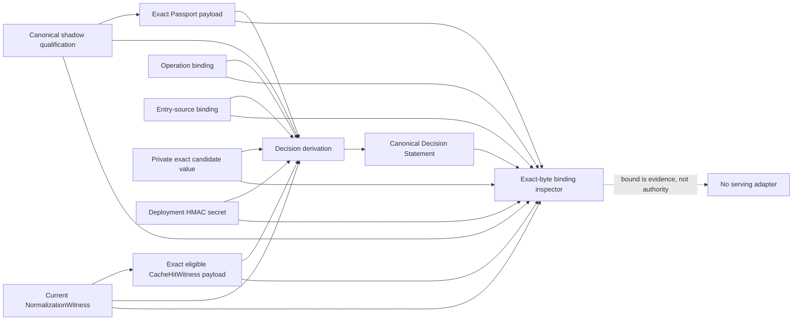

# Cache Admission Decision Statement v0.1

_Per-hit lineage for a shadow decision, deliberately not permission to serve_

## Outcome

The Cache Admission Decision Statement binds one exact Cache Admission Passport
to one exact eligible `CacheHitWitness`. It answers a narrow audit question:

> Which exact qualification Passport was paired with this exact eligible
> shadow would-hit, and which independently verifiable cross-links connect the
> pair?

It is a separate artifact from both existing layers:

- the **Passport** says one held-out qualification passed its gates;
- the **CacheHitWitness** records the mechanical shadow admission result;
- the **Decision Statement** binds the exact two payloads and their cross-links
  into portable, content-free per-hit lineage.

It does not replace a cache, policy engine, authorizer, signer, transparency
service, or runtime admission controller.

The normative predicate contract is
[`v0.1`](../attestations/cache-admission-decision/v0.1.md).

## Trust boundary



The value and HMAC secret cross only the trusted creation or inspection
boundary. They are required to reject value substitution and recompute keyed
commitments; neither is serialized or written to stdout.

## Security posture

The following values are fixed and cannot be overridden:

| Field                 | v0.1 value         |
| --------------------- | ------------------ |
| Profile               | `intent-plan-read` |
| Authentication        | `none`             |
| Mode                  | `shadow`           |
| Decision              | `eligible`         |
| Applied               | `false`            |
| Activation ceiling    | `shadow-only`      |
| Serving authority     | `none`             |
| Raw source/value      | excluded           |
| Current authorization | not enforced       |
| Clock/revocation      | not enforced       |
| Replay protection     | not implemented    |

The final four rows are not deferred implementation details hidden behind a
positive verdict. They define the boundary of the claim. A consumer must not
translate `bound: true` into `authorized`, `approved`, `fresh`, `non-replayed`,
or `safe to serve`.

## Joint subjects and lineage

The Statement has exactly two subjects in canonical order:

1. SHA-256 of the exact canonical Passport payload bytes;
2. SHA-256 of the exact canonical `CacheHitWitness` payload bytes.

The first digest is not the Passport's `canonicalProfileDigest`. An
extension-eliding profile digest cannot identify signed or received bytes.

The predicate then carries only derived lineage:

- qualification, normalization, hit-witness, operation-binding, and
  entry-source-binding digests;
- the qualification-declared deployment-scope digest; namespace, tenant,
  principal, authorization, context, domain, and operation commitments;
- a deployment-keyed cache key and domain-separated entry/value commitments;
- admission and normalization policy digests; the qualification-declared full
  dependency inventory digest;
- fixed privacy flags proving raw source, value, and identifiers were not
  intentionally embedded.

The entry-source HMAC and current normalization source HMAC are allowed to be
different. That is the expected semantic-cache case: the stored entry came from
one wording and the current request from a compatible wording. The
entry-source-binding digest preserves the original lineage without falsely
claiming byte equality.

The hit witness does not carry the Passport's deployment-scope digest or its
complete provider/model/store dependency inventory. Therefore v0.1 cross-links
namespace, tenant, operation registry, planner, tool registry, policies, and
the other fields present in both evidence families, while naming the remaining
fields `qualificationDeploymentScopeDigest` and
`qualificationDependenciesDigest`. Those two fields preserve what the exact
Passport declared; they are not proof that the individual hit was produced
under every qualified runtime attribute.

## API

The format is exported from `semwitness/intent/host`:

```ts
import {
  createIntentCacheAdmissionDecisionStatement,
  serializeIntentCacheAdmissionDecisionStatement,
  verifyIntentCacheAdmissionDecisionStatementBinding,
} from 'semwitness/intent/host';

const evidence = {
  passport: exactPassportBytes,
  qualification,
  cacheHitWitness: exactCacheHitWitnessBytes,
  normalizationWitness,
  operationBinding,
  entrySourceBinding,
  cacheKeySecret: deploymentSecret,
  value: exactCandidateValueBytes,
};

const statement = createIntentCacheAdmissionDecisionStatement(evidence);
const payload = serializeIntentCacheAdmissionDecisionStatement(statement);
const verification = verifyIntentCacheAdmissionDecisionStatementBinding(
  new TextEncoder().encode(payload),
  evidence,
);

console.assert(verification.profileBound);
console.assert(verification.canonicalPayload);
console.assert(verification.bound);
console.assert(verification.servingAuthority === 'none');
```

Creation requires exact canonical Passport and hit-witness bytes. The parser
can normalize bounded monotonic in-toto extensions, but the binding inspector
will not bind an extended payload.

Object-only inspection deliberately reports `profileBound: true` and
`bound: false` for an otherwise matching object because an object has no exact
payload identity.

## Installed CLI and plugin

Put the deployment HMAC secret in an explicitly named environment variable. The
secret itself never appears in argv:

```bash
export SEMWITNESS_CACHE_KEY_SECRET="$(openssl rand -base64 32)"

semwitness intent admission create \
  --qualification <shadow-qualification.json> \
  --passport <passport.statement.json> \
  --cache-hit-witness <cache-hit-witness.json> \
  --normalization-witness <normalization-witness.json> \
  --operation-binding <operation-binding.json> \
  --entry-source-binding <entry-source-binding.json> \
  --cache-key-secret-env SEMWITNESS_CACHE_KEY_SECRET \
  --value-file <private-candidate-value> \
  --statement-out <admission-decision.statement.json> \
  --json
```

Use a secret-manager supplied value with at least 256 bits generated by a
CSPRNG; a human passphrase or repeated 32-byte pattern does not protect
low-entropy values from offline guessing. Track rotation as an external key
epoch because v0.1 intentionally carries no key identifier.

Creation writes canonical bytes with no trailing line feed and refuses existing
paths and symlinks. On POSIX the file mode is owner-only `0600`. On Windows the
caller must place output under a pre-provisioned, owner-restricted directory
ACL because POSIX mode bits do not define the DACL. Stdout contains only a
creation result with the fixed security ceiling and Statement/subject digests;
it never echoes the secret, candidate value, Statement, scope commitments, or
input paths.

Inspection uses the same private evidence plus the Statement:

```bash
semwitness intent admission inspect \
  --statement <admission-decision.statement.json> \
  --qualification <shadow-qualification.json> \
  --passport <passport.statement.json> \
  --cache-hit-witness <cache-hit-witness.json> \
  --normalization-witness <normalization-witness.json> \
  --operation-binding <operation-binding.json> \
  --entry-source-binding <entry-source-binding.json> \
  --cache-key-secret-env SEMWITNESS_CACHE_KEY_SECRET \
  --value-file <private-candidate-value> \
  --json
```

Exit codes are stable:

- `0`: creation succeeded or inspection is exactly bound;
- `2`: the Statement is well formed but mismatched, extended, or non-canonical;
- `1`: malformed, unsafe, missing, oversized, symlinked, or unreadable input,
  missing secret, value mismatch during creation, or output publication failure.

## Why this is not called a receipt

“Receipt” now has a precise transparency meaning in SCITT and COSE. A SCITT or
COSE Receipt can prove registration or inclusion by a transparency service; it
does not prove a SemWitness admission decision was correct. Naming this artifact
a Decision Statement avoids conflating business-decision lineage with log
inclusion evidence.

An external transparency adapter can register the exact Statement later. The
registration receipt remains a separate artifact.

## Future authenticated activation

A future DSSE/Sigstore adapter may authenticate exact Statement bytes using
`application/vnd.in-toto+json`. It cannot change the signed predicate's
`shadow-only` ceiling.

Active serving requires a new, separate protocol with at least:

- an authenticated approval envelope and explicit trust policy;
- a current authorizer rather than a replayed authorization commitment;
- trusted clock, expiry, revocation, and key-epoch enforcement;
- an atomic nonce/idempotency replay store;
- current compatibility and freshness evaluation;
- a serving adapter that remains fail closed.

Those properties must not be retrofitted as optional v0.1 fields or inferred
from a signature.
