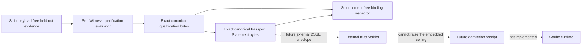

# Cache Admission Passport Statement v0.1

_Portable qualification lineage, deliberately not cache authorization_

## Outcome

The Cache Admission Passport Statement converts one content-free
`IntentCacheShadowQualificationManifest` into a small, deterministic
[in-toto Statement v1](https://github.com/in-toto/attestation/blob/main/spec/v1/statement.md).
It lets CI, plugins, gateways, and audit systems exchange the identity, scope,
contracts, evidence digests, and validity claims of the exact qualification
without copying a corpus, prompt, normalized Intent IR, candidate, plan, or
cache value.

The v0.1 result is an **unsigned, shadow-only lineage artifact**:

- `authentication` is `none`;
- `decision` is `shadow-qualified`;
- `activationCeiling` is `shadow-only`;
- binding verification returns `bound`, never `authorized`, `approved`,
  `admissible`, or a live-serving decision.

A Passport Statement cannot activate cache reads or writes. It is not a bearer
credential.

The normative predicate specification is
[`v0.1`](../attestations/cache-admission-passport/v0.1.md).

## Why this belongs in SemWitness

RedisVL, GPTCache, semantic routers, prefix caches, LMCache, and KV-cache
infrastructure own lookup, storage, routing, eviction, and runtime telemetry.
They do not own SemWitness's held-out qualification rules. The Passport is a
thin interoperability boundary over that existing evidence, not another cache
engine.

The first profile remains intentionally narrow:

| Field              | v0.1 value         |
| ------------------ | ------------------ |
| Cache artifact     | plan               |
| Effect             | read               |
| Candidate origin   | normalized intent  |
| Evidence source    | host-attested      |
| Authentication     | none               |
| Activation ceiling | shadow observation |

Observation, response, provider-prefix, and KV-cache profiles require their own
compatibility and conformance evidence. They are not aliases for this profile.

## Flow and trust boundary



The Statement and qualification are separate artifacts. Each file is the exact
UTF-8 canonical serialization emitted by SemWitness, with no trailing line
feed. The Statement's single subject is the lowercase hexadecimal SHA-256
digest of the exact qualification file bytes, without the `sha256:` prefix.
Every predicate field is derived from the same parsed qualification; callers
cannot add an issuer, approval, policy result, timestamp, or operational
permission.

## Wire contract

The controlled, stable predicate TypeURI is:

```text
https://github.com/aantenore/semwitness/blob/main/docs/attestations/cache-admission-passport/v0.1.md
```

The TypeURI identifies the `v0.1` compatibility family. The Passport artifact
uses semantic version `0.1.0`. The normative specification defines the complete
shape; its central fields are:

```jsonc
{
  "_type": "https://in-toto.io/Statement/v1",
  "subject": [
    {
      "name": "semwitness-intent-cache-shadow-qualification",
      "digest": { "sha256": "<64 lowercase hex>" },
    },
  ],
  "predicateType": "https://github.com/aantenore/semwitness/blob/main/docs/attestations/cache-admission-passport/v0.1.md",
  "predicate": {
    "artifact": {
      "id": "semwitness-cache-admission-passport",
      "version": "0.1.0",
    },
    "profile": "intent-plan-read",
    "authentication": "none",
    "decision": "shadow-qualified",
    "activationCeiling": "shadow-only",
    "basis": {
      "schema": "semwitness.dev/intent-cache-shadow-qualification/v1alpha1",
      "artifact": {
        "id": "semwitness-intent-cache-shadow-qualifier",
        "version": "1",
      },
      "provenance": "host-attested-unsigned",
      "evidenceAuthentication": "none",
      "producerIdentity": null,
    },
    "validity": {
      "notBefore": "1970-01-01T00:00:00.000Z",
      "notAfter": "1970-01-01T00:00:00.001Z",
      "revocationId": "hmac-sha256:revocation:<64 lowercase hex>",
    },
    "scope": {
      "deploymentScopeDigest": "sha256:<64 lowercase hex>",
      "cacheNamespace": "hmac-sha256:cache-namespace:<64 lowercase hex>",
      "tenant": "hmac-sha256:tenant:<64 lowercase hex>",
      "domain": "hmac-sha256:intent-domain:<64 lowercase hex>",
      "operation": "hmac-sha256:operation:<64 lowercase hex>",
    },
    "contracts": {
      "cacheAdmissionPolicyDigest": "sha256:<64 lowercase hex>",
      "normalizationPolicyDigest": "sha256:<64 lowercase hex>",
      "dependenciesDigest": "sha256:<64 lowercase hex>",
    },
    "evidence": {
      "reportDigest": "sha256:<64 lowercase hex>",
      "evaluatorDigest": "sha256:<64 lowercase hex>",
    },
  },
}
```

`notBefore` and `notAfter` are canonical RFC 3339 UTC strings with millisecond
precision. They are deterministically converted from the qualification's epoch
values. `dependenciesDigest` covers the full canonical dependency inventory,
including the prompt, tool, planner, provider, model, tokenizer, embedding,
candidate index, store, record-authentication, freshness, invalidation, and key
artifact bindings. The Passport does not contain their payloads or credentials.

## API

The `semwitness/intent/host` export owns the format:

```ts
import {
  INTENT_CACHE_ADMISSION_PASSPORT_DSSE_PAYLOAD_TYPE,
  createIntentCacheAdmissionPassportStatement,
  digestIntentCacheAdmissionPassportCanonicalProfile,
  parseIntentCacheAdmissionPassportStatement,
  serializeIntentCacheAdmissionPassportStatement,
  verifyIntentCacheAdmissionPassportStatementBinding,
} from 'semwitness/intent/host';

const statement = createIntentCacheAdmissionPassportStatement(qualification);
const serialized = serializeIntentCacheAdmissionPassportStatement(statement);
const payload = new TextEncoder().encode(serialized);

console.assert(!serialized.endsWith('\n'));
console.assert(
  INTENT_CACHE_ADMISSION_PASSPORT_DSSE_PAYLOAD_TYPE ===
    'application/vnd.in-toto+json',
);

const result = verifyIntentCacheAdmissionPassportStatementBinding(
  payload,
  qualification,
);
console.assert(result.bound && !result.extensionsPresent);
```

`canonicalProfileDigest` identifies the normalized, supported profile after
unknown in-toto extensions have been removed. `payloadDigest` identifies the
exact supplied string or bytes; it is `null` when the verifier receives only an
object. `canonicalPayload` reports whether those supplied bytes equal the
supported canonical serialization and is likewise `null` for object input.

These distinctions are security-relevant. An exact-payload receipt or signature
commitment must use the original payload bytes or `payloadDigest`, never the
extension-eliding `canonicalProfileDigest`.

## Installed CLI and plugin

Create a new private, no-clobber Statement file:

```bash
semwitness intent passport create \
  --qualification <shadow-qualification.json> \
  --statement-out <passport.statement.json> \
  --json
```

The qualification input file and emitted Statement file are exact canonical
UTF-8 bytes without a trailing line feed. On success, stdout contains only a
content-free creation receipt with digests and the fixed shadow-only status; it
does not echo the Statement or its scope HMACs.

Inspect the file against the separate qualification:

```bash
semwitness intent passport inspect \
  --statement <passport.statement.json> \
  --qualification <shadow-qualification.json> \
  --json
```

Creation returns exit `0` only after the qualification parses and the private
`0600` Statement is atomically published. Existing files and symlinks are
refused. Inspection returns `0` for a valid strict content-free binding, `2`
for a well-formed Statement that is not bound, and `1` for malformed, unsafe,
oversized, or unreadable input.

The Statement is limited to 16 KiB, 12 JSON levels, 256 parsed items, and 1 KiB
per string. Qualification CLI input is limited to 256 KiB. JSON input rejects
duplicate keys, unsafe numbers, malformed UTF-8, proxies, accessors, symbols,
hidden fields, custom prototypes, sparse arrays, and additional subjects.

## Monotonic parsing, strict binding

The in-toto Statement and predicate parser follows the framework's monotonic
extension rule: bounded, data-only unknown fields may be ignored and removed
from the normalized supported value. This keeps a v0.1 parser forward-compatible
with benign additions.

Binding deliberately applies a stricter content-free policy. If any extension
is present, verification reports `extensionsPresent: true` and `bound: false`,
even when the normalized supported profile matches. Therefore standard in-toto
fields such as subject `content`, or a predicate extension carrying a raw
prompt, cannot disappear behind normalization and still pass binding. The
underlying SemWitness qualification remains a closed schema.

For string or byte input, binding also requires `canonicalPayload: true`.
Pretty printing, trailing whitespace, alternative key order, or alternate JSON
escapes therefore return exit `2` with `bound: false`; they cannot become a
covert byte channel behind an equal normalized profile. Object-only API input
has no exact byte identity and reports `canonicalPayload: null`.

## Authentication, time, and replay

The exported media type is the standard in-toto JSON payload type recommended
for [DSSE envelopes](https://github.com/in-toto/attestation/blob/main/spec/v1/envelope.md).
No envelope is emitted in v0.1. An external DSSE signer signs
`PAE(payloadType, payload)`, as defined by the
[DSSE protocol](https://github.com/secure-systems-lab/dsse/blob/master/protocol.md),
which authenticates both `application/vnd.in-toto+json` and the exact Statement
payload bytes. A verifier must verify that PAE and signature before passing the
same decoded payload bytes to the parser. Parsing and reserializing first is
unsafe.

Even a valid external signature would authenticate only the signed Statement
under the verifier's external trust policy. It would not repair the
qualification's `evidenceAuthentication: none`, prove the corpus was held out,
or raise `activationCeiling: shadow-only`.

`notBefore`, `notAfter`, and `revocationId` are copied claims. The binding
inspector does not read a clock, query revocation, or maintain replay state.
Replay has no runtime effect because the Statement has no serving authority. A
future authenticated approval envelope must add trusted signer policy, time,
revocation, exact deployment binding, and fail-closed replay handling without
changing the meaning of this Statement.

## Privacy and operational handling

Content-free does not mean public. Stable scope HMACs and artifact digests leak
equality and workload shape to anyone able to compare Statements. Keep
qualification and Passport files private with mode `0600`, enforce
deployment-level ACLs and retention, and do not publish them as CI artifacts,
logs, issue attachments, or release assets.

## Why a future Admission Receipt is separate

A long-lived qualification cannot safely decide reuse of an individual entry.
An active design also needs a short-lived receipt bound to the exact Passport
payload digest, candidate/value commitments, current scope, compatibility
digest, policy/key epochs, freshness, nonce or sequence, and a replay store.
Low-entropy request commitments must be keyed per scope rather than plain
hashes.

That receipt is deliberately not implemented. The portable proof and policy
may be shared across RedisVL, GPTCache, semantic routers, LMCache, llm-d, or
other adapters; physical keys and values remain adapter-specific.

## Out of scope

- live cache lookup, read, write, serving, or eviction;
- Redis, vector-store, gateway, prefix-cache, or KV-cache adapters;
- DSSE assembly, private keys, KMS, PKI, Sigstore, or transparency logs;
- issuer or approval claims;
- clock, revocation, replay, or trust-policy enforcement;
- observation, response, prefix, or KV compatibility profiles;
- raw prompts, responses, Intent IR, plans, embeddings, candidates, values,
  credentials, provider payloads, URLs, paths, or errors;
- LLM calls or a new normalizer.

## Release gate

The profile ships only when deterministic golden bytes, exact qualification and
Statement file digests, qualification subject binding, every derived-field
mutation, RFC 3339 validation, extension monotonicity, strict content-free
binding, non-canonical byte rejection, strict JSON and resource limits,
data-only isolation, privacy
snapshots, CLI exit codes, receipt-only stdout, private no-clobber writes,
package export, and installed plugin execution all pass.
