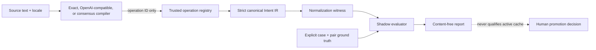

# IntentWitness Normalizer Lab

_Bounded shadow compiler evaluation — 2026-07-15_

## Outcome

Normalizer Lab tests a concrete hypothesis behind semantic caching: multiple
surface forms can converge on the same typed Intent IR, while near-misses remain
separate or explicitly bypass. It produces bounded, content-free evidence about
a fixed normalizer and corpus; repeatability is measured rather than assumed for
remote models. It never reads or serves a cached artifact.

The lab remains an isolated bounded context in SemWitness. It shares strict JSON,
canonical hashing, witness, privacy, and evaluation primitives with the compression
pipeline, but has independent schemas and public APIs. A repository split is
deferred until adoption, runtime, governance, or release cadence actually diverges.

## Implemented boundary



The compiler is non-authoritative. It may propose an operation ID and bounded
candidate evidence, but the trusted operation registry owns goal, effect, slots,
constraints, temporal semantics, and output contract. An unknown operation,
malformed output, exception, abort, ambiguity, or confidence below policy becomes
a shadow bypass.

The core binds the supplied source fingerprint to the exact source before calling
an adapter: plain SHA-256 is recomputed, while an HMAC fingerprint requires the
trusted host to supply the matching secret at this boundary. A mismatch is
malformed input, not a normalizer result.

The offline default is `builtin-declarative-exact-alias@1.0.0`. It is a
deterministic conformance baseline, not a general natural-language model. The
optional OpenAI-compatible and consensus implementations pass through the same
port, registry, schemas, witness, corpus, and fail-closed gates.

## Exact-alias behavior

Configuration uses
`semwitness.dev/intent-operation-registry/v1alpha1`. It contains an ontology,
minimum confidence, and explicitly declared operations and aliases. Configuration
cannot import code, execute a process, supply a regex, or override the built-in
normalizer artifact identity. Its canonical `configDigest` is recomputed locally.

For candidate lookup the built-in adapter:

1. rejects malformed Unicode and bounded-input violations;
2. applies Unicode NFKC compatibility normalization;
3. lowercases without locale-specific semantic rewriting;
4. trims and collapses ASCII whitespace;
5. performs no stop-word deletion or fuzzy semantic rewrite; NFKC may fold
   compatibility punctuation and numerals such as `？` to `?` or `①` to `1`;
6. performs one exact lookup on `locale + NUL + normalized alias`.

Configuration load fails on duplicate operation IDs, normalized alias collisions,
unknown fields, malformed Intent IR, or ontology mismatch. Operation and alias
ordering does not change behavior or `configDigest`.

## Optional and consensus compilers

`OpenAICompatibleIntentCompiler` is exported from
`semwitness/intent/openai-compatible`. It sends the configured operation catalog
and each selected source to an OpenAI-compatible `/chat/completions` provider,
but the model may return only a strict operation-ID proposal. The registry—not
the model—owns goal, effect, slots, constraints, temporal semantics, and output.

The adapter digest-binds the endpoint, provider/model, optional API-key
environment-variable name, bounded execution policy, registry, prompt/template,
and strict output schema. Runtime execution uses temperature zero, zero retries,
no tools, and telemetry disabled. Credentials are never accepted as config
values: `environmentRef`, when present, must name a `SEMWITNESS_*` environment
variable containing the credential. Transport permits HTTPS or loopback HTTP
only, one configured origin and resolved `chat/completions` pathname, no
query/hash/credentials or redirects, and bounded timeout plus declared/streamed
response bytes. Refusal, warning, unexpected content, unknown operation,
malformed output, timeout, or abort becomes a content-free compiler bypass.

`ConsensusIntentCompiler`, exported from `semwitness/intent`, implements an
`all-agree` policy over two to eight members with distinct manifests and the
same ontology. Every successful member must produce the same valid,
unambiguous operation. Confidence is the minimum member confidence and evidence
is combined deterministically within policy bounds. An all-member no-match can
remain no-match; mixed no-match/proposal, disagreement, ambiguity, failure,
malformed output, or abort bypasses. Agreement is not proof of semantic
equivalence and never grants cache authority.

## Evaluation fixture

The strict JSONL schema is
`semwitness.dev/intent-normalizer-eval-fixture/v1alpha1`. It has two record types:

- `case`: source, locale, split, difficulty, phenomena, and exact Intent IR or
  bypass ground truth;
- `comparison`: an explicit `equivalent` or `distinct` relation between two
  normalized cases in the same split.

Explicit pairs avoid generating a quadratic number of synthetic comparisons.
The parser rejects duplicate normalized inputs, duplicate and dangling IDs,
self-pairs, duplicate unordered case pairs, cross-split families or
comparisons, renamed families for the same expected Intent IR, inconsistent
family ground truth, and pair labels that contradict canonical Intent IR
digests. Multiple distinct case pairs may reuse a family pair so adversarial
surface variants all receive coverage. They remain curated, correlated trials:
their count is never an IID sample or a statistical confidence bound.
Expected-bypass cases do not enter pair statistics; an accepted bypass case is
counted separately as an unsafe accept.

Fixtures and normalizer configuration contain text and Intent IR and must be
handled as test data. Parsed fixtures are immutable. The report contains
ordinal-derived opaque case references and binding digests, counts, allowlisted
reason codes, and allowlisted
per-phenomenon aggregates. It does not copy case/family/ontology labels, source
text, aliases, slots, constraints, or goal fields.

## Metrics and gate

Every normalized case receives binary exact credit: the canonical Intent IR digest
matches ground truth or it does not. The report keeps these dimensions separate:

- exact intent accuracy;
- bypass accuracy and unsafe accepts;
- repeatability and execution failures;
- equivalent-pair convergence recall;
- distinct-pair false merges;
- per-phenomenon pass rates.

The default two attempts catch deterministic drift without pretending to measure
model variance. One attempt is invalid; up to 20 attempts are allowed. Every
attempt contributes to unsafe-accept and aligned comparison checks. The CLI gate
fails on any case, comparison, unsafe accept, execution failure, repeatability
failure, or contract drift.

Fixture relationships are curated and potentially correlated, so the automatic
report always sets `falseMergeUpperBound95Ppm: null` and
`statisticalReadiness.ready: false`. It explicitly records
`IID_SAMPLING_NOT_ATTESTED`; a green conformance gate is not a confidence bound.

The checked-in lab fixture contains 96 positive intent cases across 12 semantic
families and 24 safety-bypass cases. Its 48 equivalent pairs cover every
positive case once. Its 96 distinct pairs cover every positive case twice,
including all surface variants. Those balanced degrees are a deterministic
coverage invariant, not 96 independent observations and not evidence for a
binomial false-merge bound.

For an externally designed and independently validated IID sample with zero false
merges in `n` trials, the exported math helper can calculate the exact one-sided
95% binomial upper bound:

```text
upper95 = 1 - 0.05^(1 / n)
upper95Ppm = ceil(upper95 * 1,000,000)
```

Approximately 2,995 independent zero-error trials are needed to reach 1,000 ppm
and 29,957 to reach 100 ppm. This helper is not applied to built-in fixture pairs.
A small conformance corpus can pass its declared expectations, but cannot
masquerade as statistical production evidence.

Every report sets `activeCacheQualified: false`. The existing IntentWitness
promotion sequence and independent application-level shadow comparison remain
mandatory.

## Resumable host evaluation

`runIntentNormalizerEvaluation(...)` is the resumable form of the existing
library evaluator. `evaluateIntentNormalizer(...)` remains its unbounded
compatibility wrapper and produces the same report bytes as before.

A host supplies a private `IntentEvaluationCheckpointStore`, a
`checkpointBindingDigest`, and optionally `maxNewObservations`. The host digest
must bind everything outside the fixture that should invalidate a run, such as
the compiler deployment, configuration revision, credential identity, and
application release. SemWitness combines it with the corpus, split, attempt
count, and evaluation policy to derive opaque attempt references.

The store contract has two phases:

1. `inspect(claim)` returns a completed checkpoint, a missing slot, or an
   indeterminate prior claim;
2. `begin(claim)` atomically acquires a missing slot, observes a concurrent
   completion, or reports an existing indeterminate claim.

After acquisition, SemWitness calls the compiler once and awaits `commit(...)`
before advancing. Completed records contain only digests, reason codes, an
opaque case reference, and the attempt ordinal. They contain no source, case or
family ID, registry label, operation name, prompt, or model output. Returned
records are strictly validated for exact fields, run/slot binding, outcome
shape, reason codes, and self-digest before they contribute to a report.

The atomic claim closes the ordinary concurrent-worker race. If a process stops
after the provider responds but before its checkpoint commits, the durable claim
has an unknown outcome. The runner returns `indeterminate` and deliberately does
not repeat the call. This version exposes no in-place recovery operation and
does not propagate the attempt reference as a provider idempotency key, so that
run remains fail-stopped even when the provider has an idempotency feature. A
new host-authorized run uses a new binding and repeats the campaign rather than
silently guessing the missing outcome. Checkpoint digests detect accidental
mutation; they are not signatures, cache authority, or proof that the storage
host is honest.

`maxNewObservations: 0` is valid: it verifies and replays already committed
records without making a new compiler call. An incomplete result never contains
a partial evaluation report; only SemWitness finalizes the report after every
required attempt is present.

## CLI

Run the checked-in conformance example:

```bash
pnpm semwitness intent evaluate \
  --normalizer examples/intent-normalizer.json \
  --fixture examples/intent-normalizer-eval.jsonl \
  --split conformance \
  --runs 2 \
  --json
```

The optional remote path uses a strict versioned binding and a paired capability
opt-in:

```bash
pnpm semwitness intent evaluate \
  --normalizer examples/intent-normalizer.json \
  --fixture examples/intent-normalizer-eval.jsonl \
  --compiler-config examples/intent-compiler.openai-compatible.json \
  --allow-network \
  --max-requests 100 \
  --split conformance \
  --runs 2 \
  --json
```

The binding schema is `semwitness.dev/intent-compiler-binding/v1` with exactly
`{schema, adapter, config}` and an allowlisted `openai-compatible` adapter.
Duplicate keys, unknown fields, embedded secret values, or unsupported adapters
are rejected. `--compiler-config` without `--allow-network` and the inverse both
exit 1. Before compiler construction, the CLI multiplies cases selected by
`--split` by `--runs` and rejects totals above bounded `--max-requests` (default
100). A runtime counter enforces the precomputed ceiling as defense in depth.

Remote use sends fixture source text to the configured provider. It is
appropriate only for approved data and endpoints; the report remains
content-free and `activeCacheQualified: false`.

Exit codes are stable:

- `0`: the evaluation ran and all declared case/comparison gates passed;
- `2`: the evaluation ran but at least one gate failed;
- `1`: command, file, schema, or configuration input was invalid.

The CLI intentionally has no `intent normalize` or cache-serving command. Host
integrations use `normalizeIntentShadow(...)` from `semwitness/intent`, keep raw
data inside their trust boundary, and remain responsible for authoritative scope,
authorization, freshness, and ordinary uncached execution.

## Deliberate limitations

- The offline default normalizes only declared aliases; unseen paraphrases
  bypass.
- No entity, unit, temporal, coreference, or contextual resolution exists yet.
- The optional model proposes only an operation ID. No fuzzy score, embedding
  threshold, LLM judgment, compiler consensus, or JSON repair participates in
  admission or ground truth.
- The checked-in corpus is a curated lab fixture, not evidence of production
  language coverage or statistical independence.
- A valid normalization witness is still only candidate evidence for the existing
  tiered cache-admission gates.
- The Codex plugin cannot transparently replace prompt ingress. Actual token
  savings require a visible SDK/App Server integration or gateway before the
  provider call.
