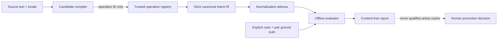

# IntentWitness Normalizer Lab

_Offline shadow baseline — 2026-07-15_

## Outcome

Normalizer Lab tests a concrete hypothesis behind semantic caching: multiple
surface forms can converge on the same typed Intent IR, while near-misses remain
separate or explicitly bypass. It produces deterministic, content-free evidence
about a fixed normalizer and corpus. It never reads or serves a cached artifact.

The lab remains an isolated bounded context in SemWitness. It shares strict JSON,
canonical hashing, witness, privacy, and evaluation primitives with the compression
pipeline, but has independent schemas and public APIs. A repository split is
deferred until adoption, runtime, governance, or release cadence actually diverges.

## Implemented boundary



The compiler is non-authoritative. It may propose an operation ID and bounded
candidate evidence, but the trusted operation registry owns goal, effect, slots,
constraints, temporal semantics, and output contract. An unknown operation,
malformed output, exception, abort, ambiguity, or confidence below policy becomes
a shadow bypass.

The core binds the supplied source fingerprint to the exact source before calling
an adapter: plain SHA-256 is recomputed, while an HMAC fingerprint requires the
trusted host to supply the matching secret at this boundary. A mismatch is
malformed input, not a normalizer result.

The first compiler is `builtin-declarative-exact-alias@1.0.0`. It is a
deterministic conformance baseline, not a general natural-language model. A future
LLM or embedding adapter must pass through the same port, registry, schemas,
witness, corpus, and fail-closed gates.

## Exact-alias behavior

Configuration uses
`semwitness.dev/intent-operation-registry/v1alpha1`. It contains an ontology,
minimum confidence, and explicitly declared operations and aliases. Configuration
cannot import code, execute a process, supply a regex, or override the built-in
normalizer artifact identity. Its canonical `configDigest` is recomputed locally.

For candidate lookup the built-in adapter:

1. rejects malformed Unicode and bounded-input violations;
2. applies Unicode NFKC compatibility normalization;
3. lowercases without locale-specific semantic rewriting;
4. trims and collapses ASCII whitespace;
5. performs no stop-word deletion or fuzzy semantic rewrite; NFKC may fold
   compatibility punctuation and numerals such as `？` to `?` or `①` to `1`;
6. performs one exact lookup on `locale + NUL + normalized alias`.

Configuration load fails on duplicate operation IDs, normalized alias collisions,
unknown fields, malformed Intent IR, or ontology mismatch. Operation and alias
ordering does not change behavior or `configDigest`.

## Evaluation fixture

The strict JSONL schema is
`semwitness.dev/intent-normalizer-eval-fixture/v1alpha1`. It has two record types:

- `case`: source, locale, split, difficulty, phenomena, and exact Intent IR or
  bypass ground truth;
- `comparison`: an explicit `equivalent` or `distinct` relation between two
  normalized cases in the same split.

Explicit pairs avoid generating a quadratic number of synthetic comparisons.
The parser rejects duplicate normalized inputs, duplicate and dangling IDs,
self-pairs, duplicate unordered pairs, repeated distinct family pairs,
cross-split families or comparisons, renamed families for the same expected
Intent IR, inconsistent family ground truth, and pair labels that contradict
canonical Intent IR digests. These checks reduce obvious inflation; they do not
prove statistical independence. Expected-bypass cases do not enter pair
statistics; an accepted bypass case is counted separately as an unsafe accept.

Fixtures and normalizer configuration contain text and Intent IR and must be
handled as test data. Parsed fixtures are immutable. The report contains
ordinal-derived opaque case references and binding digests, counts, allowlisted
reason codes, and allowlisted
per-phenomenon aggregates. It does not copy case/family/ontology labels, source
text, aliases, slots, constraints, or goal fields.

## Metrics and gate

Every normalized case receives binary exact credit: the canonical Intent IR digest
matches ground truth or it does not. The report keeps these dimensions separate:

- exact intent accuracy;
- bypass accuracy and unsafe accepts;
- repeatability and execution failures;
- equivalent-pair convergence recall;
- distinct-pair false merges;
- per-phenomenon pass rates.

The default two attempts catch deterministic drift without pretending to measure
model variance. One attempt is invalid; up to 20 attempts are allowed. Every
attempt contributes to unsafe-accept and aligned comparison checks. The CLI gate
fails on any case, comparison, unsafe accept, execution failure, repeatability
failure, or contract drift.

Fixture relationships are curated and potentially correlated, so the automatic
report always sets `falseMergeUpperBound95Ppm: null` and
`statisticalReadiness.ready: false`. It explicitly records
`IID_SAMPLING_NOT_ATTESTED`; a green conformance gate is not a confidence bound.

For an externally designed and independently validated IID sample with zero false
merges in `n` trials, the exported math helper can calculate the exact one-sided
95% binomial upper bound:

```text
upper95 = 1 - 0.05^(1 / n)
upper95Ppm = ceil(upper95 * 1,000,000)
```

Approximately 2,995 independent zero-error trials are needed to reach 1,000 ppm
and 29,957 to reach 100 ppm. This helper is not applied to built-in fixture pairs.
A small conformance corpus can pass its declared expectations, but cannot
masquerade as statistical production evidence.

Every report sets `activeCacheQualified: false`. The existing IntentWitness
promotion sequence and independent application-level shadow comparison remain
mandatory.

## CLI

Run the checked-in conformance example:

```bash
pnpm semwitness intent evaluate \
  --normalizer examples/intent-normalizer.json \
  --fixture examples/intent-normalizer-eval.jsonl \
  --split conformance \
  --runs 2 \
  --json
```

Exit codes are stable:

- `0`: the evaluation ran and all declared case/comparison gates passed;
- `2`: the evaluation ran but at least one gate failed;
- `1`: command, file, schema, or configuration input was invalid.

The CLI intentionally has no `intent normalize` or cache-serving command. Host
integrations use `normalizeIntentShadow(...)` from `semwitness/intent`, keep raw
data inside their trust boundary, and remain responsible for authoritative scope,
authorization, freshness, and ordinary uncached execution.

## Deliberate limitations

- Only declared aliases normalize; unseen paraphrases bypass.
- No entity, unit, temporal, coreference, or contextual resolution exists yet.
- No fuzzy matching, edit distance, embedding threshold, LLM judge, or JSON repair
  participates in admission or ground truth.
- The example corpus is a conformance fixture, not evidence of general language
  coverage.
- A valid normalization witness is still only candidate evidence for the existing
  tiered cache-admission gates.
